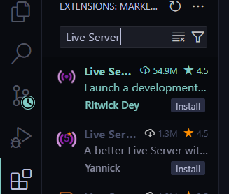
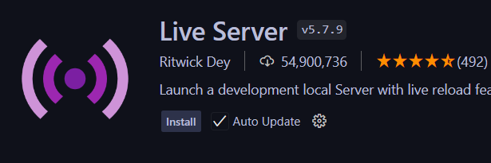
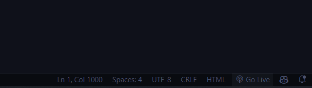
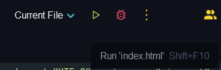
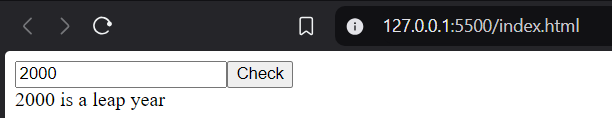
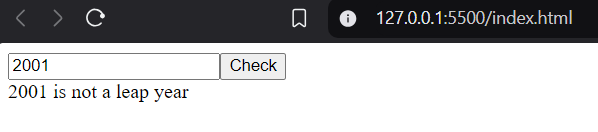

# Spaghetti Code Tournament

## Task №1:  
The code checks whether the entered year is a leap year.

## How to run the code?
Download **index.html** file and host it with:

1. Live Server VS Code Extension  
   - Open Extensions Tab  
   - Type "Live Server"  
     
   - Install  
     
   - Press "Go Live" button  
     

2. Built-in function in WebStorm  
   - Just press "Start" button (or Shift + F10)  
     

## How the program works  
  
  
